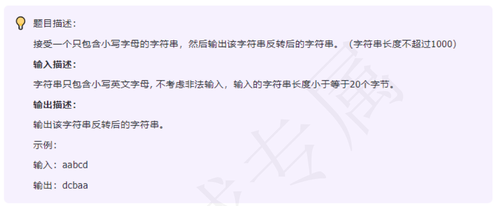

### day02


---
```c++
#include<iostream>
#include<cstring>
using namespace std;
int main(){
    char str[1001];
    cin >> str;
    for(int i = std::strlen(str) - 1; i >= 0; i --){
        cout << str[i];
    }
    return 0;
}
```