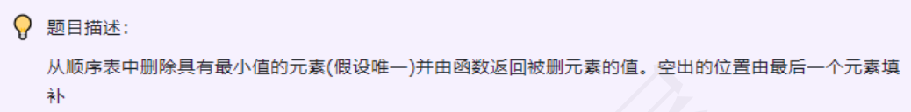

### day03



---
### 思路
* 遍历顺序表，同时记录下每次最小的元素的值和下标位置,最后用尾部元素填补，并返回值。

### 代码
```c++
int DeleteMinRet(int a[], int n){
    int min = a[0], k = 0;
    for(int i = 1; i < n; i ++){
        if(a[i] < min) min = a[i], k = i;
    }
    a[k] = a[n - 1];
    return min;
}
```