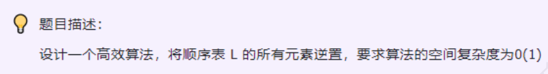

### day04



--- 

### 思路
和day02相同，两端往中间遍历，交换。

### 答案
```c++
//直接下标处理完成交换
void reverse(Sqlist &L){
    int tmp;//交换变量
    for(int i = 0;i<L.length/2;i++){
        tmp = L[i];
        L[i] = L[L.length-1-i];
        L[L.length-1-i] = tmp;
    }
}
//双指针⽅式处理 完整代码
void reverse2(int arr[] , int len) {
    int* first = arr;//指向第⼀个元素
    int* end = first + len -1;//指向尾部元素
    //只要前⾯⼩于后⾯就循环交换
    while( first < end ) {
        int temp = *first;
        *first++ = *end;
        *end-- = temp;
    }
}
//len为数组⻓度
void reverse2(int arr[] , int len) {
//先把前指针指向数组头部
    int* first = arr;、
//把后指针指向数组尾部
    int* end = first + len -1;
    while( first < end ) {
        int temp = *first;
/*
这⾥优先级不⼀样
实际执⾏顺序应该是把end指针指向的元素赋给first指针指向的元素，然后再把first指针往后挪(*first的优先级>first++)
也就是相当于执⾏：*first = *end; first++;
*/
        *first++ = *end;
/*
这步骤可能有个⼩疑问，既然两个指针要替换为什么不同时first++。end--呢（*first++ = *end--;）？
因为我们下⼀步还需要把temp的值赋给*end，如果提前把end--了，就相当于把temp赋给了end之前的那个元素，此时我们应该把temp赋
*/
        *end-- = temp;
    }
}
```

### 代码尝试
```c++
void reverseSqList(SqList &list){
    int tmp = 0, i = 0;
    for(; i < list.length/2; i ++){
       tmp = list.data[i];
       list.data[i] = list.data[list.length - i - 1];
       list.data[list.length - i - 1] = tmp;
    }
}
```