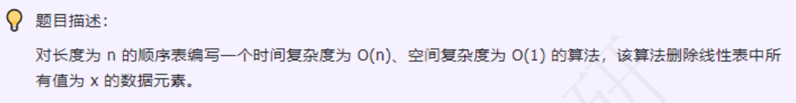

### day05



### 思路尝试

`p1用来保存覆盖位置，p2作for循环变量遍历数组`

p2和p1同时从0开始遍历，遇到非x元素，则让data[p2]覆盖到data[p1]位置, 并且p1++；

否则跳过当前p2`元素值为x`,并记录cnt++,继续往后遍历到上限length

length -= cnt长度去除值为x的元素的个数

### 代码尝试
```c++
void deleteX(SqList &list, int x){
    int p1 = 0, p2 = 0, cnt = 0;
    for(; p2 < list.length; p2++){
        //出现x则跳过
        if (list.data[p2] == x) {
            cnt++;
        }
        // 否则 将非x元素前移到p1处
        else{
           list.data[p1] = list.data[p2]
           p1++;
        }
    }
    // length变化
    list.length -= cnt;
}
```

