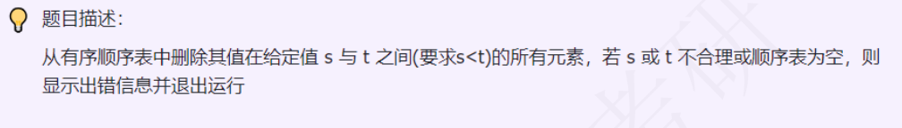

### day08



### 思路尝试

类似day05顺序表中删除所有值为x的元素

`双指针`遍历顺序表，p1保存位置，负责记录每次将要被覆盖的位置；

p2向后遍历，遇到范围内的元素直接跳过并且cnt+1，否则`(不在范围内)`覆盖到p1位置，并p1++

直到p2==length退出循环

表长length -= cnt

### 代码尝试
```c++
void deleteValueRange(SqList &list, int a, int b){
    if (a >= b || !list.length){
        cout << "error!(must a < b and list.length != 0)" << endl;
        return;
    }
    int p1 = 0, p2 = 0, cnt = 0;
    while(p2 < list.length){
        if (list.data[p2] < a || list.data[p2] > b){
            list.data[p1] = list.data[p2];
            p1++, p2++;
        }
        else{
            cnt++, p2++;
        }
    }
    list.length -= cnt;
}
```
