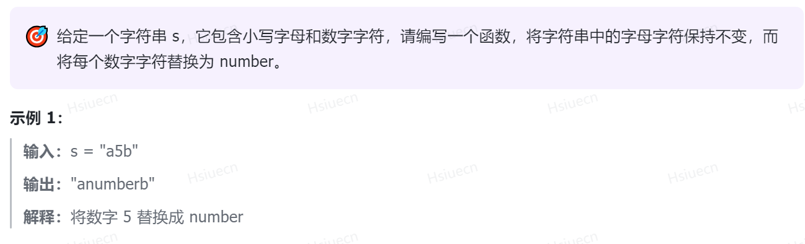

#### 替换数字



#### 思路

利用双指针，先统计好多少个数字，再扩展string长度，从后往前，开始依次对比赋值，遇到字母则直接赋值，
遇到数字则赋为number字符。

```c++
const string number= "number";
string replaceNumber(string s){
    int cnt = 0;
    for (const auto &item: s) {
        if (item >= '0' && item <= '9') cnt++;
    }
//    cout << "cnt = " << cnt << endl;
    int i = s.size() - 1, j = s.size() + cnt * 5 - 1;
    s.resize(s.size() + cnt * 5, '0');
    while (i < j){
        if (s[i] >= 'a' && s[i] <= 'z') s[j] = s[i], i--, j--;
        else{
            for (int k = 0; k < 6; ++k) {
                s[j - 5 + k] = number[k];
            }
            j -= 6, i--;
        }
    }
    return s;
}
```