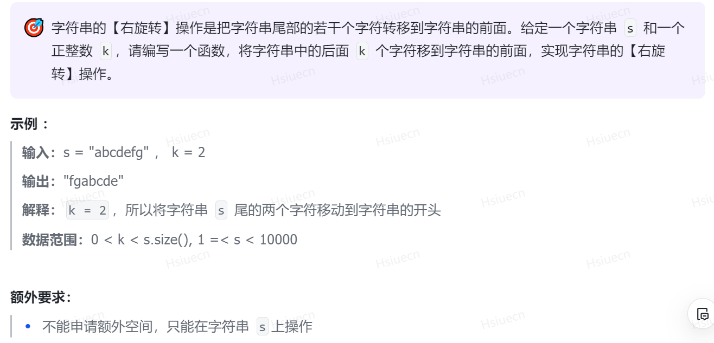

旋转字符串，先对两个部分分别进行反转，再对整体进行反转。
```c++
string rightRotate(string s, int k){
    // 左闭右开 reverse内参数
    reverse(s.begin() + s.size() - k, s.end());
    reverse(s.begin(), s.begin() + s.size() - k);
    reverse(s.begin(), s.end());
    return s;
}
```
