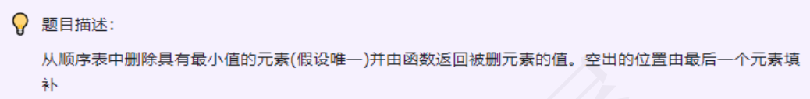

### day03



---
### 思路
* 遍历顺序表，同时记录下每次最小的元素的值和下标位置,最后用尾部元素填补，并返回值。

### 答案

```c++
#include <iostream>
#include <vector>
using namespace std;
int removeMinValue(vector<int>& sequence) {
    if (sequence.empty()) {
        cerr << "顺序表为空！" << endl;
        return -1; // 返回-1表⽰错误
    }
    int minInd = 0;
    int minVal = sequence[0];
    for (int i = 1; 1 < sequence.size(); i++) {
// ⽐较获取最⼩值和其索引
        if(sequence[i] < minVal) {
            minVal = sequence[i];
            minInd = i;
        }
    }
    int deletedVal = sequence[minInd];
    sequence[minInd] = squence.back(); // 最后⼀个元素填补删除位
    sequence.pop_back(); //删除最后⼀个元素
    return deletedVal; // 返回删除值
}
```

### 代码尝试
```c++
int DeleteMinRet(int a[], int n){
    int min = a[0], k = 0;
    for(int i = 1; i < n; i ++){
        if(a[i] < min) min = a[i], k = i;
    }
    a[k] = a[n - 1];
    return min;
}
```