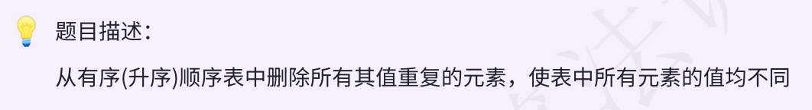

### day09



### 思路尝试

`与day8主体思路相似，双指针，p1指向每次将要被覆盖的位置，p2依次后移`

p1 p2 从 1 开始

cmp为每次比较的元素值，初始化为data[0]，每次p2移动后，则更新cmp为p2前一个值

p2移动过程中，如果cmp == data[p2], 则p2++, cnt++ `记录被删除（重复元素）的个数`

否则 data[p1] = data[p2], 并 p1++, p2++

直到p2 == length

最后 length -= cnt

### 代码尝试
```c++
void deleteDuplicate(SqList &list){
    if (!list.length){
        cout << "error!" << endl;
        return;
    }
    int p1 = 1, p2 = 1, cnt = 0, cmp = list.data[0];
    while(p2 < list.length){
        if (cmp == list.data[p2]) {
            p2++, cnt++;
        }
        else{
            list.data[p1] = list.data[p2];
            cmp = list.data[p1];
            p1++, p2++;
        }
    }
    list.length -= cnt;
}
```