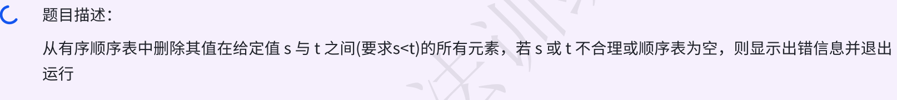

### day10



### 思路尝试

先判定给定范围是否合法，以及顺序表是否非空

遍历顺序表，找到给定值范围的顺序表的下标范围i、j(包括i、j上的元素)

如果给定范围b超过顺序表最大元素，则b == length - 1

调用day06的删除下标范围内所有元素函数`deleteRange(SqList &list, int i, int j)`

### 代码尝试
```c++
void deleteSortedValueRange(SqList &list, int a, int b){
    if (a >= b || !list.length){
        cout << "error!" << endl;
        return;
    }
    int i = -1, j = -1;
    for (int k = 0; k < list.length; ++k) {
        // 第一个 >= a的元素的下标
        if (i == -1 && list.data[k] >= a) i = k;
        // 最后一个 <= 元素的下标
        if (j == -1 && list.data[k] > b) j = k - 1;
    }
    // b超过 顺序表最大元素的值
    if (j == -1) j = list.length - 1;
    // 调用 删除下标范围内所有元素
    // 若 i == -1 说明整个顺序表的元素都  < a
    // deleteRange函数不做处理
    deleteRange(list, i, j);
}
```