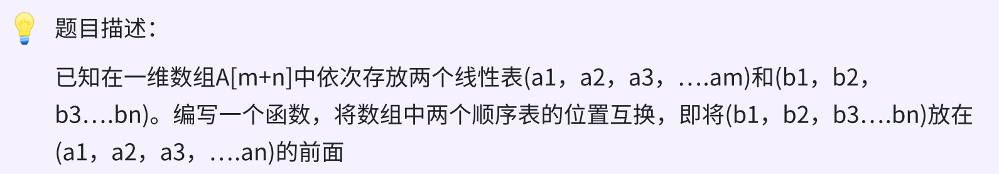

### day12



### 思路

先对前一个顺序表进行逆置，再对后一个顺序表逆置，最后整体进行逆置。

### 代码

```c++
void superReverse(SqList &list, int l1, int l2){
    int tmp = 0, i = 0, j = l1;
    // 逆置 前一个顺序表
    for(; i < l1/2; i ++){
        tmp = list.data[i];
        list.data[i] = list.data[l1 - i - 1];
        list.data[l1 - i - 1] = tmp;
    }
    // 逆置后一个顺序表
    for(; j < (list.length + l1)/2; j ++){
        tmp = list.data[j];
        list.data[j] = list.data[(list.length - 1) - (j - l1)];
        list.data[(list.length - 1) - (j - l1)] = tmp;
    }
    // 整体逆置
    for(i = 0; i < list.length / 2; i ++){
        tmp = list.data[i];
        list.data[i] = list.data[list.length - i - 1];
        list.data[list.length - i - 1] = tmp;
    }
}
```