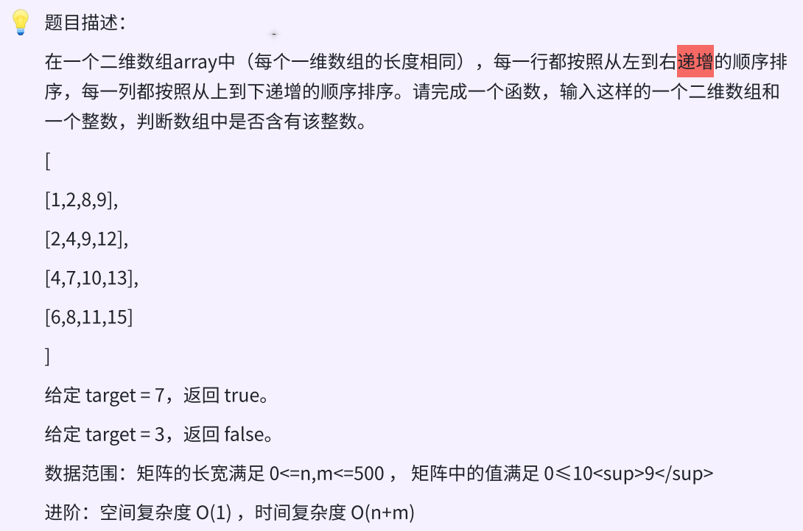

### day13



### 思路

从左下角开始查找

元素等于target就返回true，

元素大于target就往上走 `即 cow --` 

元素小于target就往右走 `即 col ++`

超出边界则返回flase

### 代码

```c++
bool searchInSortedArray(vector<vector<int>> arr, int target){
    // 从左下角元素开始往右上方搜索
    int row = arr.size() - 1, col = 0;
    while(row >= 0 && col < arr[0].size()){
        if (arr[row][col] == target) return true;
        else if (arr[row][col] < target) col ++;
        else row --;
    }
    return false;
}
```