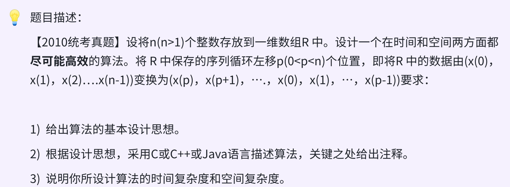
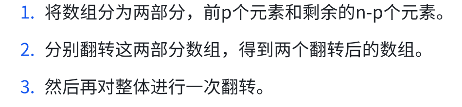

### day18



### 思路

* 常规：暴力。`时间O(n) 空间O(n)`

利用辅组数组，先存下前p个元素，然后让原数组左移动p位，最后再把辅组数组内元素覆盖原数组后p位。

* 局部逆置+整体逆置。`时间O(n) 空间O(1)`

和day12思路一样。相当于把前一个顺序表和后一个顺序表进行换位置。


### 代码 
```c
void reverseArray(int arr[], int low, int high){
    int tmp;
    while (low < high){
        tmp = arr[low];
        arr[low] = arr[high];
        arr[high] = tmp;
        low++, high--;
    }
}

void leftRotate(int arr[], int n, int p){
    if (p > n || p < 0) return;

    reverseArray(arr, 0, p - 1);
    reverseArray(arr, p, n - 1);
    reverseArray(arr, 0, n - 1);
}
```