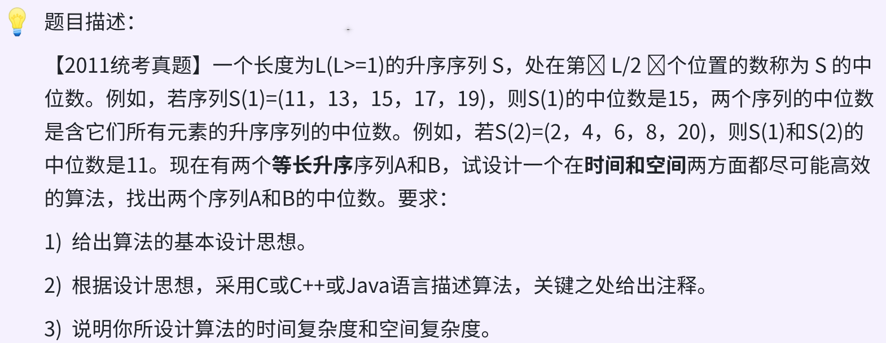

### day19



### 思路

* 双指针   时间`O(n+m)`    空间`O(1)`   

pa指向序列A的第一个元素，pb指向序列b的第二个元素，cnt记录移动次数；

pa和pb的元素进行比较，pa <= pb则pa++后移动，否则pb++后移动，每次移动后cnt++计数；

每次移动计数后，特判cnt是否等于单个序列长度length`（A和B长度相同）`，直接return。


### 代码
```c
int SerachMiddleInTwo(int arrA[], int arrB[], int length){
    int pa = 0, pb = 0, cnt = 0;
    while(pa < length && pb < length){
        if (arrA[pa] <= arrB[pb]){
            cnt++;
            if (cnt == length) return arrA[pa];
            pa++;
        }
        else{
            cnt++;
            if (cnt == length) return arrB[pb];
            pb++;
        }
    }
}
```