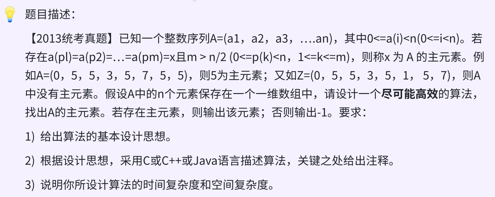

### day20

### 思路
* 投票算法  时间 `O(n)`   空间 `O(1)`
* 通过不断抵消不同元素，来寻找候选主元素。

初始化时，cand = arr[0], cnt = 1；

从第二个元素开始遍历，如果和cand相同则cnt++，否则cnt--；

每当cnt==0时，则更新cand为当前元素，并置cnt=1。

最后再重新遍历数组，计算次数，如果>n/2则return cand，否则return -1.

### 代码
```c
int findMajorityElement(int arr[], int n){
    if (!n) return -1;
    int cand = arr[0], cnt = 1;
    for (int i = 1; i < n; ++i) {
        if (arr[i] == cand) cnt++;
        else cnt--;
        if (!cnt){
            cand = arr[i];
            cnt = 1;
        }
    }
    cnt = 0;
    for (int i = 0; i < n; ++i) {
        if (arr[i] == cand) cnt++;
    }
    if (cnt > (n/2)) return cand;
    else return -1;
}
```

