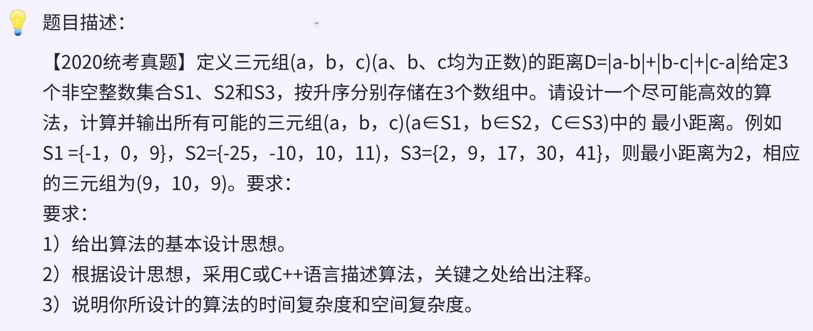

### day21



### 思路

* __贪心 + 三指针__  时间O(n * m * p)  空间O(1)

三元组距离图示如下，时间长distance长度是2*ac，与中间的元素无关。


每次计算出最小的那个元素，然后只移动最小的元素，后移一位，重新计算，直到三元组的某一组到达表尾。

* 王道基本设计思想  2.2.3.14

1、使用minDist记录所有已处理的三元组的最小距离，初始为一个足够大整数0x7fffffff

2、集合S1、S2、S3分别保存在数组A、B、C中。数组的下标变量i=j=k=0，当i<|S1|、j<|S2|、k<|S3|时，循环执行下面：

---- 计算最小距离。

---- 更新最小距离。

---- 将三者中最小值的下标+1.

3、输出minDist，结束。

### 代码
```c
int findMinDistofTrip(int A[], int n, int B[], int m, int C[], int p){
    int i = 0, j = 0, k = 0, minDist = INT_Max, tmp;
    while (i < n && j < m && k < p && minDist > 0){
        tmp = abs(A[i] - B[j]) + abs(A[i] - C[k]) + abs(B[j] - C[k]);
        if (tmp < minDist) minDist = tmp;
        if (firstIsMin(A[i], B[j], C[k])) i++;
        else if (firstIsMin(B[i], A[j], C[k])) j++;
        else k++;
    }
    return minDist;
}
```
