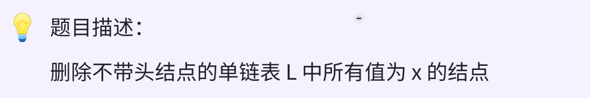
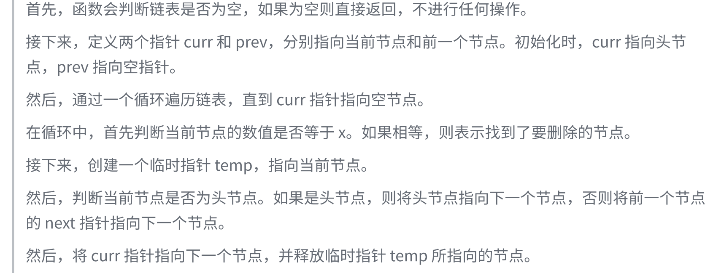

### day26



### 思路


### 代码
```c++
void deleteNodesWithValue(LinkList &L, int x){
    if (!L) return;
    LNode* curr = L, *prev = nullptr;
    while (curr){
        if (curr->data == x){
            LNode* tmp = curr;
            // 如果是第一个结点，特判
            if (L == curr){
                L = curr->next;
            } else{
                prev->next = curr->next;
            }
            curr = curr->next;
            delete(tmp);
        } else{
           prev = curr, curr = curr->next;
        }
    }
}
```