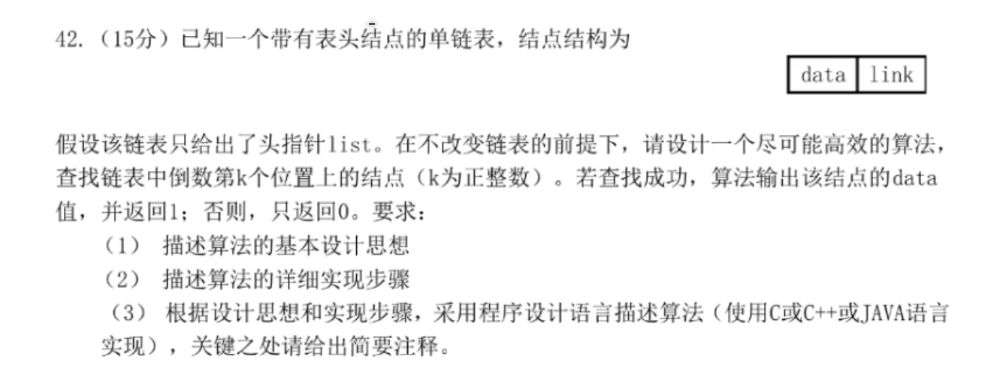

### day27



### 思路
利用双指针，通过遍历一遍链表，找到结点。

pre和post指针都初始化为L.

先让post指针后移k个结点，如果在在移动完k个结点前，post为null，说明长度<K,return 0;

再让pre指针移动到第一个结点位置。

之后对双指针同时后移，直到post到达最后一个结点。此时的pre所指结点为倒数第k个结点。

### 代码
```c++
int findLastK(LinkList L, int k){
    int i = k;
    LNode *pre = L, *post = L;
    // 先让post移动到第k个结点处
    while (i && post){
        post = post->next, i--;
    }
    // post为null， 链表长度小于k
    if (!post) return 0;
    pre = pre->next; // 此时，pre和post相差k-1个位置
    // 当post为最后一个结点时，退出循环
    while (post->next){
        pre = pre->next, post = post->next;
    }
    cout << pre->data << endl;
    return 1;
}
```

