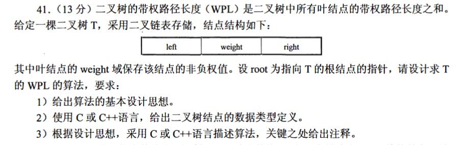

### day38



### 思路

* 利用递归，根节点所在层作为第0层，deep作为层数进行函数传参.

-- 每次特判是否为根节点，return当前结点的带权路径长度；

-- 否则，继续递归遍历左右子树。

### 代码
```c++
int calculateWPL(BiTree T, int deep){
    if (!T) return 0;
    // 根节点
    if (!T->left && !T->right)  return T->data * deep;
    // 分子结点，继续递归
    return calculateWPL(T->left, deep + 1) + calculateWPL(T->right, deep + 1);
}
```