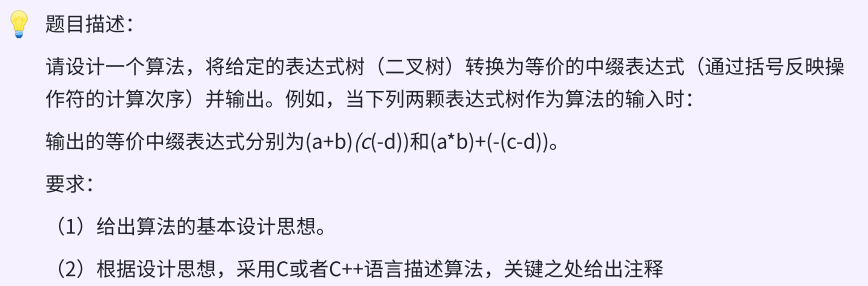
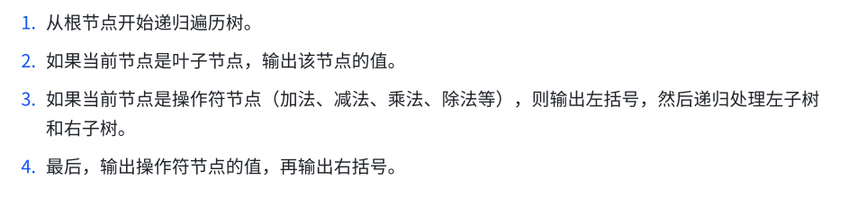

### day39



### 


### 
```c++
// 定义⼆叉树结构体
typedef struct BTNode {
    string val;
    BTNode* left;
    BTNode* right;
}BTNode,*BTree;
// 递归将表达式转化为中缀表达式
string expressionToInfix(BTree root) {
    if (!root) return "";
// 如果是叶⼦节点，直接返回值
    if (!root->left && !root->right) return root->val;
// 递归处理左右⼦树
    string leftExpr = expressionToInfix(root->left);
    string rightExpr = expressionToInfix(root->right);
// 返回中缀表达式
    return "(" + leftExpr + root->val + rightExpr + ")";
}
```